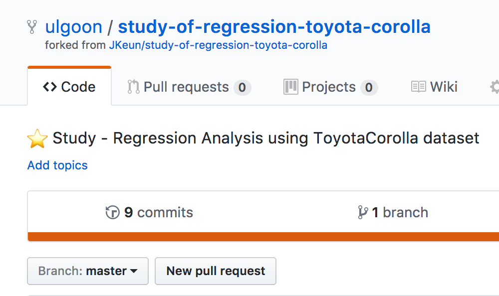
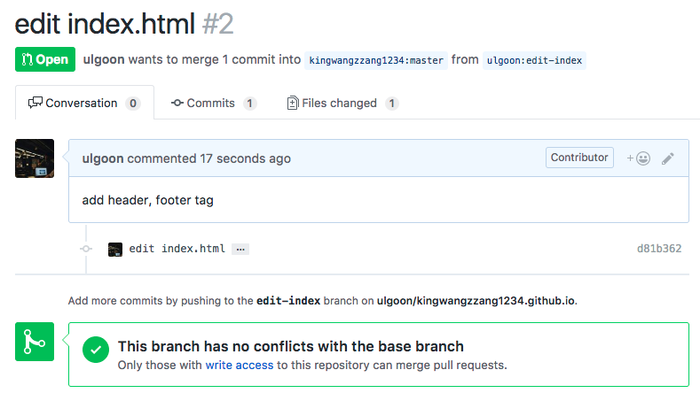
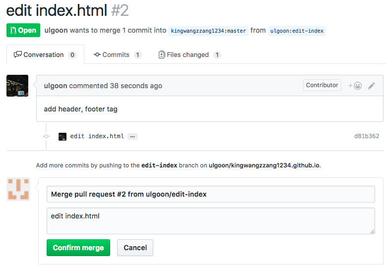
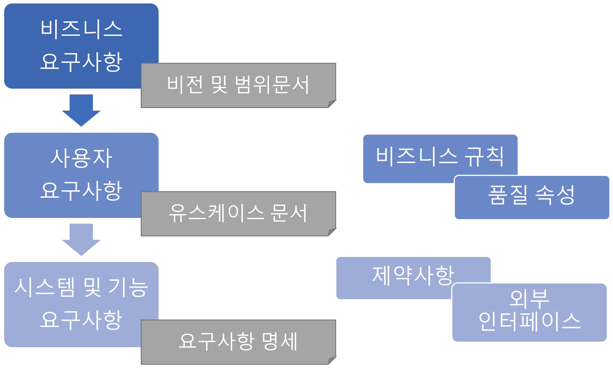

# Fastcampus Frontend Dev SCHOOL
## git, Software Engineering

---
<!--
page_number: true
$size: A4
footer : fastcampus Frontend Dev SCHOOL, Wooyoung Choi, 2018
-->

## Introduce


### 최우영
- Co-founder, Developer at disceptio
- Solution Architect, Web Developer, Instructor
- python web crawling bootcamp(gilbut, 2018 expected)
- Skills: Python, Golang, Julia, Node.js, Google tag manager ...

#### blog: https://blog.ulgoon.com/
#### github: https://github.com/ulgoon/
#### email: me@ulgoon.com


---
## git

---
## git is..

---
## git Process and Command


---
## My First Github Pages
github 저장소를 활용해 정적인 사이트 호스팅이 가능

`username`.github.io 
http://tech.kakao.com/
https://spoqa.github.io/

---
### sample index page
After create new repo throuch github,

`$ git clone https://github.com/username/username.github.io.git`

Create New file `index.html`

`$ git add .`
`$ git commit -m "first page"`
`$ git push origin master`

---
### sample index page
```html
<!doctype html>
<html>
 <head>
  <meta charset="utf-8">
  <title>My first gh page</title>
 </head>
 <body>
  <h1>Home</h1>
  <p>Hello, there!</p>
 </body>
</html>
```


---
### Static Site Generator
- [Jekyll](https://jekyllrb.com/): Ruby 기반 정적인 블로그 생성기
	- 설치와 사용이 쉬움
	- 사용자가 많았음 
- [Hugo](https://gohugo.io/): Golang 기반 정적인 블로그 생성기
	- 빠른 속도로 사이트를 생성
	- 사용자 증가 중
- [Hexo](https://hexo.io/): Node.js 기반 정적인 블로그 생성기
	- Node.js를 안다면 커스터마이즈가 쉬움
	- 빠른 속도로 사용자 증가 중

**Recommand**
`Jekyll` > `Hugo` > `Hexo`

---
## What is branch?

---
## What is branch?


---
## What is branch?
분기점을 생성하고 독립적으로 코드를 변경할 수 있도록 도와주는 모델

ex)

master branch
```python
print('hello world!')
```

another branch
```python
for i in range(1,10):
    print('hello world for the %s times!' % i)
```


---
## Branch

Show available local branch
`$ git branch`

Show available remote branch
`$ git branch -r`

Show available All branch
`$ git branch -a`

---
## Branch


Create branch
`$ git branch stem`

Checkout branch
`$ git checkout stem`

Create & Checkout branch
`$ git checkout -b new-stem`

make changes inside readme.md
`$ git commit -a -m 'edit readme.md'`
`$ git checkout master`

merge branch
`$ git merge stem`

---
## Branch

delete branch
`$ git branch -D stem`

push with specified remote branch
`$ git push origin stem`

see the difference between two branches
`$ git diff master stem`

---
## git flow strategy


---
## use git flow easily!
[Link](https://danielkummer.github.io/git-flow-cheatsheet/index.ko_KR.html)


---
## Collaborate with your Co-worker

---
## Method 1: Collaboration
Add Collaborator


---
## Collaboration
Add, Commit and Push like you own it. 

---
## Method 2: Fork and Merge


---
## Fork and Merge


---
## Fork and Merge


---
## Fork and Merge
`$ git clone https://github.com/username/forked-repo.git`


---
## Fork and Merge


`$ git branch -a`
`$ git checkout -b new-feature`

---
## Fork and Merge

Make some change

`$ git add file`
`$ git commit -m "commit message"`
`$ git push origin new-feature`

---
## Fork and Merge


---
## Fork and Merge


---
## Fork and Merge


---
## Fork and Merge


---
## Fork and Merge


---
## Fork and Merge


---
## Fork and Merge


## Software Engineering

---
## Software Engineering
### Definition

Software engineering (SWE) is the application of engineering to the design, development, implementation, testing and maintenance of software in a systematic method.
--> 소프트웨어의 개발, 운용, 유지보수 등의 생명 주기 전반을 체계적이고 서술적이며 정량적으로 다루는 학문

---
## Software Engineering


### Why??

---
## Development vs Implementation

- Development
	- The process of analysis, design, coding and testing software.
- Implementation
	- The installation of a computer system or an information system.
	- The use of software on a particular computer system.

---
## Trend of Software Engineering

- Acceleration of **DevOps** adoption
- Continued wave of everything natively mobile
- Greater demand for increased privacy
- Cloud computing will be a thing of the past
- integration with Web and Mobile App

---
## DevOps

used to refer to a set of practices that emphasizes the **collaboration and communication** of both software developers and other information-technology (IT) professionals while automating the process of software delivery and infrastructure changes. 
It aims at establishing a **culture** and **environment** where building, testing, and releasing software can happen **rapidly**, **frequently**, and more **reliably**.

---
## DevOps

- 기존의 개발과 운영 분리로 인해 발생하는 문제들
문제 발생 -> 비방 -> 욕 -> 상처 -> 원인분석 -> 문제해결

- 좋은 소프트웨어를 위한 필수조건
	- 기획팀과의 원활한 소통으로 요구사항을 충실히 반영
	- 운영팀과의 원활한 소통으로 소비자 불만과 의견을 반영

---
## DevOps

운영과 개발을 통합하여 커뮤니케이션 리소스를 줄이고, 개발 실패 확률을 줄임과 동시에 보다 안정적인 서비스를 운영할 수 있음!!


---
## Software Development Life Cycle

---
## Requirements Analysis

---
## Requirements
> 무엇이 구현되어야 하는가에 대한 명세

시스템이 어떻게 동작해야 하는지 혹은 시스템의 특징이나 속성에 대한 설명

---
## Requirements Analysis
시스템 공학과 소프트웨어 공학 분야에서 수혜자 또는 사용자와 같은 다양한 이해관계자의 상충할 수도 있는 요구사항을 고려하여 새로운 제품이나 변경된 제품에 부합하는 요구와 조건을 결정하는 것과 같은 업무

---
## Requirements Analysis

나(개발자)와 클라이언트(사장) 모두를 만족시키기 위한 연결고리

---
## Requirements Analysis
- 요구사항 유도(수집): 대화를 통해 요구사항을 결정하는 작업
- 요구사항 분석: 수집한 요구사항을 분석하여 모순되거나 불완전한 사항을 해결하는 것
- 요구사항 기록: 요구사항의 문서화 작업

---
## Requirements Layer


---
## Business Requirements
> "Why"

---
## Business Requirements
> "왜" 프로젝트를 수행하는지
- 고객이 제품을 개발함으로써 얻을 수 있는 이득
- Vision and Scope(비전과 범위)

---
## User Requirements
> "What"

---
## User Requirements
> 사용자가 이 제품을 통해 할 수 있는 "무엇"
- Use cases, Scenarios, User stories, Event-response tables, ..

---
### use case diagram


---
### user scenario


---
### user stories


---
## Functional Requirements
> "What"

---
## Functional Requirements
> 개발자가 이 제품의 "무엇"을 개발할 것인지
- '~ 해야 한다' 로 끝나 반드시 수행해야 하거나 사용자가 할 수 있어야 하는 것들에 대해 작성

---
## System Requirements
- 여러개의 서브 시스템으로 구성되는 제품에 대한 최상위 요구사항을 설명
- 컴퓨터: 모니터 + 키보드 + 마우스 + 본체 + 스피커

---
## Business Rules
- 비즈니스 스트럭쳐의 요구나 제약사항을 명세
- "유저 로그인을 위해서는 페이스북 계정이 있어야 한다."
- "유저 프로필 페이지에 접근하기 위해서는 로그인되어 있어야 한다"

---
##  Quality Attribute
- 소프트웨어의 품질에 대해 명세
- "결제과정에서 100명의 사용자가 평균 1.5초의 지연시간 안에 요청을 처리해야 한다"

---
## External Interface
- 시스템과 외부를 연결하는 인터페이스
- 다른 소프트웨어, 하드웨어, 통신 인터페이스, 프로토콜, ..

---
## Constraint
- 기술, 표준, 업무, 법, 제도 등의 제약조건 명세
- 개발자들의 선택사항에 제한을 두는 것


---
## When the well is full, it will run over.

---
## 지나치게 자세한 명세작성
- 명세서는 말 그대로 명세일 뿐, 실제 개발 단계에서 마주칠 모든 것을 담을 수 없음
- 개발을 언어로 모두 표현할 수 없음
- 명세서가 완벽하다고 해서 상품도 완벽하리란 보장은 없음
- 때로는 명세를 작성하기 보단 프로토타이핑이 더 간단할 수 있음.


<link href="https://fonts.googleapis.com/css?family=Nanum+Gothic:400,800" rel="stylesheet">
<link rel='stylesheet' href='//cdn.jsdelivr.net/npm/hack-font@3.3.0/build/web/hack-subset.css'>

<style>
h1,h2,h3,h4,h5,h6,
p,li, dd {
font-family: 'Nanum Gothic', Gothic;
}
span, pre {
font-family: Hack, monospace;
}
</style>